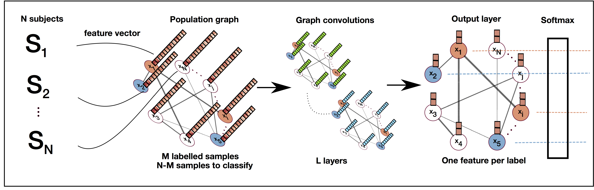
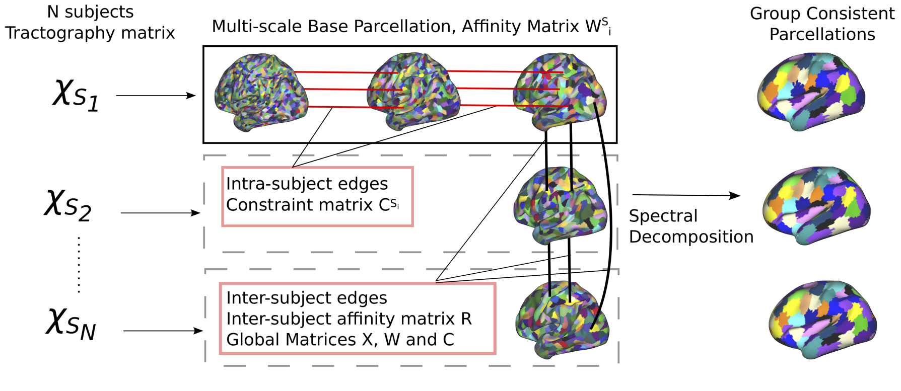

+++
date = "2015-09-06T22:04:14+01:00"
draft = false
title = "Software and Data"
menu = "main"
+++

### Brain Parcellation Survey

In Arslan et al. NeuroImage 2017, we provide a large-scale systematic comparison of more than 30 state-of-the-art connectivity-driven, anatomical, and random parcellation methods.
The preprint, as well as the code and data used for the survey are provided at [the dedicated webpage](https://biomedia.doc.ic.ac.uk/brain-parcellation-survey/).

### Software 

The Python - Tensorflow implementation of the paper: 

**Sarah Parisot**, Sofia Ira Ktena, Enzo Ferrante, Matthew Lee, Ricardo Guerrerro Moreno, Ben Glocker, Daniel Rueckert:
*Spectral Graph Convolutions for Population-based Disease Prediction*.
MICCAI 2017.

is available on github at https://github.com/parisots/population-gcn. 

It exploits the novel concept of graphs CNNs to perform semi-supervised classification of populations. 

----------

The MATLAB implementation of the paper: 

**Parisot, S.**, Arslan, S., Passerat-Palmbach, J., Wells III, W.M., Rueckert, D.: *Tractography-Driven Groupwise Multi-scale Parcellation of the Cortex*. 
In: Information Processing in Medical Imaging. pp. 600–612. Springer (2015)

is now available on github at https://github.com/parisots/SpectralParcellation. 

It performs groupwise and single-subject parcellation of the brain's cortical surface through a spectral clustering approach. 

Please note that we are making use of the code from [the multi-scale normalised cuts](http://www.timotheecour.com/software/ncut_multiscale/ncut_multiscale.html ) method introduced in 

Timothee Cour, Florence Benezit, Jianbo Shi : 
*Spectral Segmentation with Multiscale Graph Decomposition*. 
In: IEEE International Conference on Computer Vision and Pattern Recognition (CVPR), 2005.

----------

### Data 

<!---

-->

We have released the database used during my PhD for tumour segmentation and analysis. This is a set of 210 FLAIR MRI of different patients suffering from a diffuse Low Grade Glioma. All the images provided were acquired in a clinical setting, with varying quality and evolution of the disease. It results in a very challenging database for image processing tasks.  

The complete database can be found at : 
http://db-gliomas-gradeii.net/
and 
[figshare](https://figshare.com/articles/Diffuse_Low_grade_Glioma_Database/1550871) (NIFTI format)
